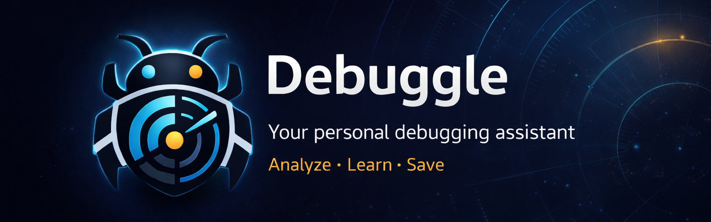

# 🐛 Debuggle

>Your personal debugging assistant. Paste an error, understand it at your level, save it, and never repeat it —_or if you do, at least you’ll know exactly what’s going on_. In the end, that’s how you learn programming: through errors and iteration.



[](https://www.gnu.org/licenses/agpl-3.0)
[](#)
[](https://claude.ai/claude-code)
[](https://openai.com/)
[](https://electronjs.org)
[](https://react.dev)

---

## What is Debuggle?

Debuggle is a desktop app for developers who want to **understand** their errors, not just fix them. Paste any stack trace or error message and get a clear explanation tailored to your experience level — then save it to your personal vault to build a knowledge base of your own debugging history.

**100% local. Your errors never leave your machine unless you choose a cloud AI provider.**

---

## Features

### 🔍 Analyze
- Paste any error (stack trace, compiler error, runtime exception)
- Choose your level: **Novice**, **Mid**, or **Expert**
- Get: what happened, how to fix it, key terms, and corrected code
- Syntax-highlighted code with one-click copy

### 💬 Ask / Chat
- After analyzing, click **"Ask about this"** to open a conversation about that specific error
- Context is pre-loaded — no need to re-explain the problem
- Full multi-turn conversation powered by your chosen AI provider

### 📖 Guide (Vault)
- Save any analysis to your personal vault
- Search by error type or language
- Master-detail layout — browse your history without losing context
- Ask the AI about any saved entry

### 📊 Patterns
- See your most frequent errors and languages at a glance
- Identify recurring issues before they become habits
- Stats update automatically as your vault grows

### ⚙️ Config
- Choose from **6 AI providers** — including free tiers
- API keys stored securely in the **OS keychain** (Windows Credential Manager / macOS Keychain / Linux GNOME Keyring)
- Keys are never written to disk in plaintext

---

## AI Providers

| Provider | Free models | Requires key |
|---|---|---|
| **Groq** | Llama 3.3 70B, Llama 3.1 8B, Mixtral 8x7B, Gemma 2 9B | Yes (free at groq.com) |
| **OpenRouter** | Llama 3.3 70B, Gemma 3 27B, Mistral 7B | Yes (free at openrouter.ai) |
| **Ollama** | Any model you have installed locally | No |
| **Anthropic** | — | Yes (paid) |
| **OpenAI** | — | Yes (paid) |
| **VeniceAI** | — | Yes |

**To get started for free:** create a free account at [console.groq.com](https://console.groq.com) → API Keys → Create Key → paste it in Debuggle's Config.

---

## Getting Started

### Prerequisites
- [Node.js](https://nodejs.org) 18+
- [pnpm](https://pnpm.io) 9+

### Install & run

```bash
git clone https://github.com/D4vRAM369/debuggle.git
cd debuggle
pnpm install
pnpm dev
```

### Run tests

```bash
pnpm test
```

### Build installer

```bash
pnpm build
pnpm pack:all
```

Outputs in `release/`:

| Platform | Format | Notes |
|---|---|---|
| Windows | `.exe` (NSIS) | Standard installer |
| Windows | `.msi` | Enterprise-friendly installer |
| Windows | `.portable` | No-install executable |
| macOS | `.dmg` + `.zip` | x64 + Apple Silicon (arm64) |
| Linux | `.AppImage` | Universal, no install needed |
| Linux | `.deb` | Ubuntu, Debian, Linux Mint |
| Linux | `.rpm` | Fedora, openSUSE, RHEL |
| Linux | `.flatpak` | Sandboxed, all distros — requires `flatpak-builder` |

> **Linux build notes:**
> - `.deb` requires `fakeroot` → `sudo apt install fakeroot`
> - `.rpm` requires `rpm-build` → `sudo dnf install rpm-build`
> - `.flatpak` requires `flatpak-builder` + `org.freedesktop.Platform//23.08` runtime

---

## Project Structure

```
debuggle/
├── electron/
│   ├── main.ts          # Main process: IPC handlers, vault (file I/O), keychain
│   └── preload.ts       # Context bridge: exposes window.api to renderer
├── src/
│   ├── pages/           # AnalyzePage, ChatPage, VaultPage, PatternsPage, ConfigPage
│   ├── components/      # AppShell, CodeBlock, shadcn/ui components
│   ├── lib/             # ai.ts, chat.ts, providers.ts, stats.ts, analyze.ts
│   ├── types/           # api.d.ts — window.api type declarations
│   └── test/            # Vitest unit tests
├── docs/
│   ├── plans/           # Implementation plan
│   └── pbl/             # Project-Based Learning notes (personal study)
└── package.json
```

---

## Tech Stack

| Layer | Technology |
|---|---|
| Desktop shell | Electron 33 |
| Build system | electron-vite |
| UI framework | React 18 + TypeScript |
| Styling | Tailwind CSS v4 + shadcn/ui |
| AI (multi-provider) | openai SDK + @anthropic-ai/sdk |
| Vault storage | Markdown files with YAML frontmatter (gray-matter) |
| Secure key storage | keytar (OS keychain) |
| Tests | Vitest |

---

## Roadmap

- [ ] Export vault to PDF / markdown
- [ ] OCR — paste a screenshot of an error
- [ ] Team vault with shared knowledge base
- [ ] Pattern-based learning suggestions
- [ ] Plugin system for custom providers

---

## Contributing

Contributions are welcome. Please open an issue before submitting a large PR so we can discuss the approach.

For bugs: include the error type, your OS, and steps to reproduce.

---

## License

Debuggle is open source under the **GNU Affero General Public License v3.0 (AGPL-3.0)**.

You are free to use, modify, and distribute this software under the terms of the AGPL-3.0. If you run a modified version as a network service, you must make your source code available.

For **commercial licensing** (if you want to use Debuggle in a proprietary product or service without the AGPL obligations), open an issue on GitHub.

See [LICENSE](LICENSE) for the full text.

---

## Acknowledgements

Built with Claude Code and GPT-5.3-Codex.
